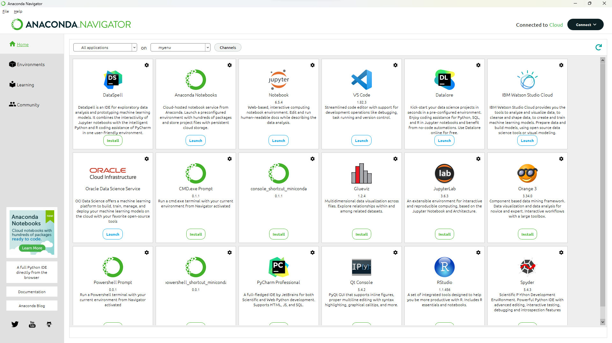
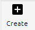
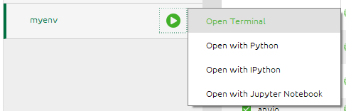
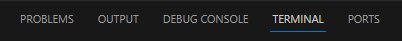
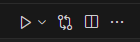
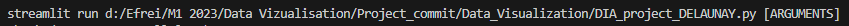

# Data_Visualization
# Data Visualisation project, Fuel prices in France - Instant flow

## Description du Projet :
In this project, I use a dataset entitled "Fuel prices in France - Instant flow" from the French government site, Data.gouv.fr.
This dataset can be consulted by following this link: https://www.data.gouv.fr/fr/datasets/prix-des-carburants-en-france-flux-instantane/.
These data are extracted from the “Fuel Prices” information system and are linked to the fuel sales points listed on the Fuel Prices website, in accordance with a ministerial decree dated December 12, 2006.

The data made available in this dataset includes several categories of essential information:

    - General information about the point of sale: This includes details such as the address of the point of sale, geographical coordinates, opening hours, and the services offered by each gas station.

    - Prices and Information System Information: You can access current fuel prices, as well as other information contained in the information system. This data is crucial for motorists and businesses that rely on fuel prices.

    - Fuel stock outs: The dataset notifies you of times when a point of sale is experiencing fuel stock outs, which can be useful for users looking for fuel.

    - Permanent or temporary closures of points of sale: You can also follow the closures, whether temporary or permanent, of the listed service stations.

As explained in the title, the data is instantaneous (updated every 10 minutes).

The project is divided into 5 parts: the introduction, a short presentation a the initial dataset, the data cleaning (in the python code - not pressented in the streamlit page), the data vizualisation and a conclusion

## Read me- table of content:

    I] Use and installation
    II] Screenshots of the different stages of the streamlit page

## I] Use and installation
You can access to the project by different ways: by using the python file or by the link: 

If you want the access it from the python file:
    - Open anaconda

    

    - Create a new virtual environment

    

    - Open the terminal

    

    - Make sure you installed all the librairies needed : pip install streamlit pandas numpy matplotlib Pillow seaborn folium plotly geopy
                                                          pip install folium-plugins

    - Launch VSCODE and also install all the librairies needed (in the VSCODE terminal)

    

    - Run the python script of VSCODE

    

    - Copy the terminal result on the environment terminal (anaconda): streamlit run -...
    
    

II] Screenshots of the different stages of the streamlit page